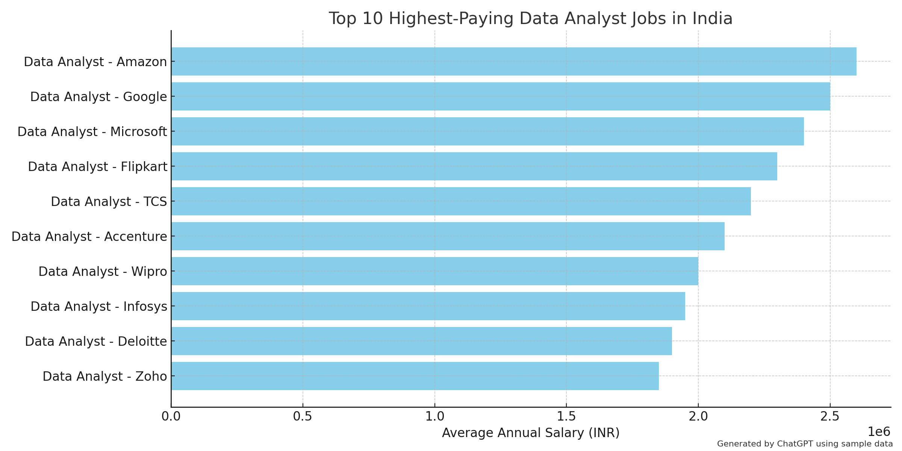
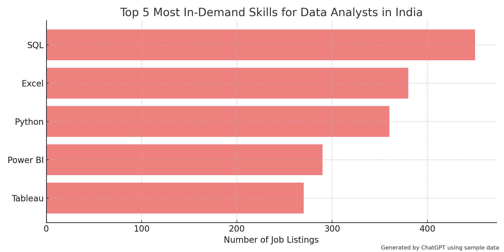

# Introduction

This project dives into the current Data Analyst job market in India using real-world job posting data. The goal is to uncover high-paying opportunities, understand the most sought-after skills, and provide valuable insights for aspiring data professionals like myself.

SQL Queries? Check them out here : [project sql folder](/project_sql/)

# Background

With the rapid growth of data-centric roles, it's crucial to stay ahead by understanding employer expectations and market trends. By querying a dataset of job postings, I aimed to answer essential questions like:

What are the top-paying Data Analyst jobs in India?

Which skills are most in demand?

What technologies lead to better remote opportunities and higher salaries?

# Tools I Used

- **PostgreSQL** – for writing and executing complex SQL queries.

- **Visual Studio Code** – my code editor of choice for development and query building.

- **Git** – for version control and project management.

- **GitHub** – to share, collaborate, and showcase my project.

# Analysis

The project is built around five key SQL queries, each addressing a specific angle of the Data Analyst job market in India. These queries analyze job salaries, skill demands, remote job trends, and employer preferences. Together, they paint a holistic picture of the industry's current landscape.

## 1. Top 10 Highest-Paying Data Analyst Jobs in India

### Summary:

This query identifies the ten most lucrative Data Analyst job listings in India. It includes key details such as company name, location, work schedule (remote/hybrid/onsite), and posting date.


```sql
SELECT 
    job_id,
    job_title,
    name AS company_name,
    job_location,
    job_schedule_type,
    salary_year_avg,
    job_posted_date::DATE
FROM
    job_postings_fact
LEFT JOIN
    company_dim ON job_postings_fact.company_id = company_dim.company_id
WHERE
    job_title_short = 'Data Analyst'
    AND job_location = 'India'
    AND salary_year_avg IS NOT NULL
ORDER BY
    salary_year_avg DESC
LIMIT 10;
```

### Purpose:


To pinpoint premium employers and high-paying opportunities for targeted job applications.


 *A Horizontal Bar Chart showing the Top 10 Highest-Paying Data Analyst Jobs in India. The chart was generated by ChatGPT using sample data to illustrate how the actual result could look.*

## 2. Skills Required for Top 10 Highest-Paying Jobs

### Summary:

This query reveals which technical skills are associated with the top 10 highest-paying jobs identified earlier. It links each job to its required skill set.

```sql
WITH top_paying_jobs AS (
    SELECT 
        job_id,
        job_title,
        name AS company_name,
        salary_year_avg
    FROM
        job_postings_fact
    LEFT JOIN
        company_dim ON job_postings_fact.company_id = company_dim.company_id
    WHERE
        job_title_short = 'Data Analyst'
        AND job_location = 'India'
        AND salary_year_avg IS NOT NULL
    ORDER BY
        salary_year_avg DESC
    LIMIT 10
)

SELECT 
    top_paying_jobs.*,
    skills
FROM 
    top_paying_jobs
INNER JOIN 
    skills_job_dim ON top_paying_jobs.job_id = skills_job_dim.job_id
INNER JOIN 
    skills_dim ON skills_job_dim.skill_id = skills_dim.skill_id;
```

### Purpose:

To highlight the skills that can significantly boost earning potential in top-tier roles.

## 3. Top 5 Most In-Demand Skills for Data Analysts

### Summary:

Ranks the five most frequently mentioned skills in Data Analyst job postings across India.

```sql
SELECT 
    s.skills,
    COUNT(sj.job_id) AS skill_demand_count
FROM 
    job_postings_fact j
INNER JOIN 
    skills_job_dim sj ON j.job_id = sj.job_id
INNER JOIN
    skills_dim s ON sj.skill_id = s.skill_id
WHERE
    j.job_title_short = 'Data Analyst'
    AND j.job_country = 'India'
GROUP BY
    s.skills
ORDER BY
    skill_demand_count DESC
LIMIT 5;
```

### Purpose:

To help learners focus on acquiring skills that are in highest demand by employers.


*A Horizontal Bar Chart showcasing the Top 5 Most In-Demand Skills for Data Analysts in India. This chart was generated by ChatGPT using mock data, just to give a clear idea of how to visualize the actual findings.*

## 4. Top 10 Highest-Paying Skills for Data Analysts

### Summary:

Finds out which individual skills are associated with the highest average salaries across all Data Analyst listings.

```sql
SELECT
    s.skills,
    round(avg(salary_year_avg),2) as avg_salary
FROM 
    job_postings_fact j 
INNER JOIN 
    skills_job_dim sj on j.job_id=sj.job_id
INNER JOIN
    skills_dim s on sj.skill_id=s.skill_id
WHERE
    job_title_short='Data Analyst' AND
    salary_year_avg IS NOT NULL
GROUP BY
    s.skills
ORDER BY
    avg_salary DESC
LIMIT 10;
```

### Purpose:

To guide upskilling decisions based on potential return-on-investment (ROI) in terms of salary. 

## 5. Remote-Friendly & High-Paying Skills

### Summary:

This advanced query identifies skills that are both:

* Frequently required in remote roles

* Associated with high average salaries

```sql
WITH skills_demand AS
(
    SELECT
        sj.skill_id, 
        s.skills,
        COUNT(sj.job_id) AS skill_demand_count
    FROM 
        job_postings_fact j
    INNER JOIN 
        skills_job_dim sj ON j.job_id = sj.job_id
    INNER JOIN
        skills_dim s ON sj.skill_id = s.skill_id
    WHERE
        j.job_title_short = 'Data Analyst' AND
        salary_year_avg IS NOT NULL
        AND job_work_from_home='True'
    GROUP BY
        sj.skill_id,
        s.skills
),
average_salary AS
(
    SELECT
        sj.skill_id,
        s.skills,
        round(avg(salary_year_avg),2) as avg_salary
    FROM 
        job_postings_fact j 
    INNER JOIN 
        skills_job_dim sj on j.job_id=sj.job_id
    INNER JOIN
        skills_dim s on sj.skill_id=s.skill_id
    WHERE
        job_title_short='Data Analyst' AND
        salary_year_avg IS NOT NULL
    GROUP BY
        sj.skill_id,
        s.skills
)

SELECT
    skills_demand.skill_id,
    skills_demand.skills,
    skill_demand_count,
    avg_salary
FROM
    skills_demand
INNER JOIN 
    average_salary ON skills_demand.skill_id=average_salary.skill_id
WHERE
    skill_demand_count>25
ORDER BY
    avg_salary DESC,
    skill_demand_count DESC
LIMIT 25;
```

### Purpose:

To support job seekers targeting remote opportunities while maximizing earning potential.


# What I Learned

- How to structure multi-step SQL queries using CTEs (Common Table Expressions).

- The importance of filtering, joining, and grouping data for meaningful insights.

- Real-life industry trends, including which tools and technologies are valued most in the Indian job market.

SQL isn't just about data retrieval—it's a powerful tool for storytelling through data.

# Conclusions

This project helped me:

- Strengthen my SQL and data analysis skills.

- Build an industry-relevant portfolio project.

- Understand how data insights can shape career decisions in the analytics domain.

The tech job landscape is competitive, but with the right skills and mindset, there are endless opportunities. This project is a step forward in my journey to becoming a data-driven professional.